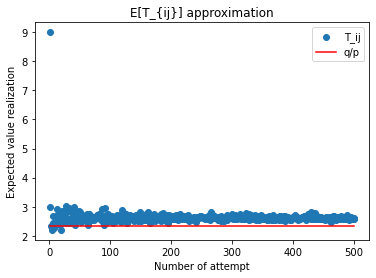
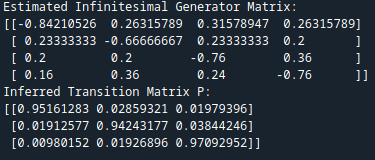
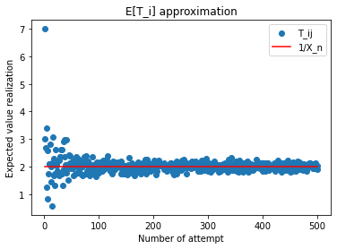
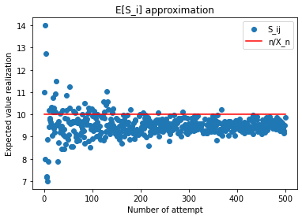
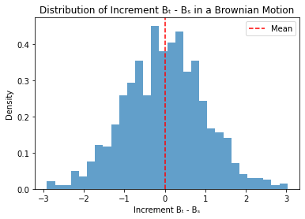

# Stochastic-Processes-Inference
Python project that will intend to make inferential analysis on different type of stochastic processes such as Markov chains, Poisson processes and Brownian Motion.

# Informe Teoría de Procesos Estocásticos

## Introducción
Con este proyecto, se busca aplicar conocimientos de Inferencia estadística a varios tipos de procesos estocásticos. El objetivo principal a desarrollar es estimar parámetros de relevancia para corroborar propiedades del proceso en cuestión y dar una prueba computacional de las aplicaciones de los procesos estocásticos enunciadas en clase. Se trabajó sobre cuatro tipos específicos de procesos estocásticos: Cadenas de Markov finitas, Cadenas de Markov continuas, Procesos de Poisson y Movimiento Browniano.

Este proyecto fue desarrollado en el lenguaje de programación *python*, junto al IDE *spyder* propio de *Anaconda*.

## Descripción del Problema
El problema principal es utilizar la Inferencia estadística para poder verificar propiedades o aplicaciones estudiadas en clase de los diferentes tipos de procesos estocásticos.

Para cada tipo de proceso estocástico se hizo inferencia sobre una aplicación o propiedad propia del proceso. En específico tenemos los siguientes problemas a afrontar:

1. En **Cadenas de Markov Finitas** se busca estimar el valor esperado del tiempo de primera visita entre dos estados; es decir, $E[T_{ij}]$ para $i, j$ estados dados. El qué tan buena es la aproximación se revisará con el hecho de que estas variables aleatorias tienen una distribución geométrica, con lo cual de paso verificaremos si el comportamiento de la variable corresponde con esta afirmación o no.

2. Para **Cadenas de Markov Continuas** se busca estimar a la matriz $Q$ generador infinitesimal, y a partir de ella presentar como sería la matriz de transiciones $P$ en un tiempo $t$ determinado.

3. En **Procesos de Poisson** se busca demostrar vía simulaciones que las variables aleatorias $T_i$ y $S_n$ tienen distribución exponencial y gamma respectivamente. Para esto aproximaremos sus parámetros de interés usando el estimador de máxima verosimilitud de cada distribución y verificando que tal se ajustan los datos a las distribuciones propuestas.

4. Para **Movimiento Browniano** se busca demostrar vía simulaciones que el incremento entre variables aleatorias tiene distribución normal con varianza el incremento.

## Aplicaciones
Las aplicaciones de las técnicas y resultados obtenidos en este proyecto se pueden agrupar en dos grupos principales:

1. Computacionales: con este proyecto podemos hacer aproximaciones fácilmente computables. Al utilizar los métodos de Inferencia, podemos aproximar el comportamiento de los procesos estocásticos y facilitar los cálculos para un análisis posterior. Además, al ser métodos numéricos que dependen más de la cantidad de datos que del complejo de las operaciones, permiten obtener buenos resultados en mejores tiempos.

2. Teóricas: podemos verificar mediante simulaciones si una variable aleatoria derivada o relacionada con un proceso estocástico tiene una cierta Distribución o cumple una cierta propiedad. Los parámetros inferidos nos permiten verificar si los datos observados siguen la distribución esperada asociada al proceso estocástico correspondiente. Esto nos permite verificar o dar una primera afirmación acerca del comportamiento de los datos asociados a un proceso estocástico específico.

Con lo cual para cada proceso con el que se trabajará las preguntas a resolver son en qué grupo se encuentra lo hecho y qué aporta.

## Tareas computacionales
Para la inferencia sobre los diversos procesos estocásticos se planean las siguientes tareas computacionales:

1. Cadena de Markov Finita:
   - Vamos a realizar inferencia sobre $T_{ij}$ tiempo de primer llegada del estado $i$ al estado $j$. Para esto primero vamos a tomar unos datos de una Cadena de Markov fija y vamos a calcular el tiempo de primera llegada entre estados fijos mediante una simulación.
   - Después, se repetirá la simulación un número determinado de veces y se guardarán los resultados obtenidos. Con estos resultados se buscará hacer una estimación de cuál sería el valor esperado del tiempo de primera llegada.
   - Por otro lado, vamos a utilizar el hecho de que $T_{ij}$ tiene una distribución geométrica [\cite{example-article}] y compararemos los resultados.

2. Cadena de Markov en tiempo continuo:
   - Partiendo de un conjunto finito de estados y un número de transiciones entre ellas, vamos a encontrar la matriz $Q$. Para esto vamos a relacionar el número de transiciones entre estados de tal forma de obtener la matriz $Q$.
   - Una vez tengamos la matriz $Q$, la usaremos para encontrar la matriz $P$ para un tiempo $t$ específico. Con esto tendremos las probabilidades de transición en el tiempo $t$.

3. Proceso Poisson:
   - Para ver que las variables aleatorias $T_i$ tienen una distribución exponencial encontraremos su media mediante simulación y compararemos los resultados con el valor esperado de la distribución.
   - Ahora, para ver que las variables aleatorias $S_n = \sum_{i = 1}^n T_i$ tienen una distribución gamma encontraremos su media mediante simulación y compararemos los resultados con el valor esperado de la distribución.

4. Movimiento Browniano:
   - Crear una simulación de un Movimiento Browniano estándar.
   - Repetir la simulación un número determinado de veces.
   - Observar cómo es el incremento entre los tiempos $t, s$ para $t > s$.
   - A partir de la muestra de incrementos, determinar si su varianza muestral se aproxima al valor esperado del incremento.

Los códigos correspondientes al desarrollo de todos estos objetivos se encuentran en el siguiente repositorio de Github: [https://github.com/JJFigpad/Markov-Chain-Inference.git](https://github.com/JJFigpad/Markov-Chain-Inference.git)

## Fragmentos de código

Aquí se dejarán las gráficas y resultados obtenidos. Para conocer las entradas a detalle dirigirse al repositorio del código.

1. Cadena de Markov Finita:
   

2. Cadena de Markov en tiempo continuo:
   

3. Proceso Poisson:
   
   

4. Movimiento Browniano:
   

## Discusión Final
Para cerrar, este proyecto me deja una gran satisfacción en cada uno de los puntos.

Todos los objetivos fueron alcanzados, y además se dejó todavía un mundo de posibilidades por abarcar. Pese a ser una idea sencilla, toda la teoría detrás que soporta lo hecho es tan compleja como rígida, que permite desplazarse entre conceptos con poca dificultad. Luego, apoyándose en la capacidad computacional el tiempo que se toma se vuelve casi inmediato para resolver cualquier cuestión. Para un futuro se podría pensar en expandir este proyecto, completándolo con pruebas y funciones más complejas y contundentes.

Espero esto sea un ejemplo de cómo se puede llegar a dar o verificar afirmaciones acerca de un tema usando la capacidad computacional que se pueda tener a la mano y una idea clara de lo que se está buscando.

\newpage
\printbibliography